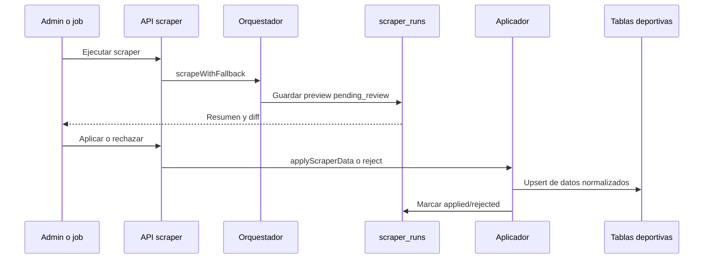
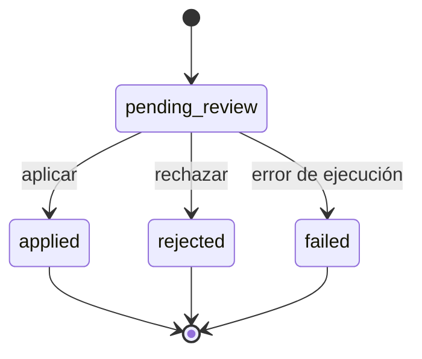

# SDD: Revisión y aplicación de ejecuciones de scrapers

> **Estado:** `completado`
> **Autor:** FutFemColombia
> **Fecha:** 2026-09-07
> **Última actualización:** 2026-09-07

---

## 1. Contexto

Un scraper puede devolver datos vacíos, incompletos o incompatibles con el estado actual. Aplicar cualquier respuesta de forma automática podría borrar marcadores, crear partidos incorrectos o publicar una fase equivocada. El panel administrativo debe separar la extracción de la aplicación y permitir revisar el diff antes de modificar los datos públicos.

### Restricciones

- El flujo depende de autenticación Supabase y de las rutas bajo `/api/admin`.
- La ejecución usa `service_role` para guardar los datos, pero las operaciones administrativas deben quedar protegidas.
- `scraper_runs` debe conservar el payload, la normalización, el diff y las advertencias.

---

## 2. Objetivos y No-Objetivos

### Objetivos

- Ejecutar scrapers desde el panel o sus endpoints.
- Guardar cada ejecución como `pending_review`, con resumen y diff.
- Permitir aplicar o rechazar una ejecución concreta.
- Auto-aplicar solo cuando no existan señales de riesgo.
- Conservar trazabilidad de ejecuciones y acciones administrativas.

### No-Objetivos

- Convertir el panel en un editor de payloads externos.
- Auto-aplicar respuestas con datos faltantes críticos.
- Exponer ejecuciones, advertencias o auditoría a usuarios públicos.
- Reemplazar la validación específica de cada scraper por una validación genérica.

---

## 3. Decisiones de Diseño

### Decisión 1: Preview antes de persistir datos deportivos

- **Elegida:** guardar `raw_data`, `normalized_data`, `diff`, `summary` y `warnings` antes de aplicar.
- **Razón:** permite revisar el impacto y conservar evidencia de lo recibido.
- **Trade-off:** requiere almacenamiento JSONB adicional y una acción explícita de aplicación.
- **Reevaluar si:** el volumen de ejecuciones hace necesario un sistema de retención/archivo.

### Decisión 2: Auto-aplicación conservadora

- **Elegida:** `shouldAutoApply` bloquea resultados vacíos, con errores o partidos programados sin fecha/hora; también aplica reglas específicas para posiciones.
- **Razón:** es mejor dejar una ejecución pendiente que sobrescribir datos válidos.
- **Trade-off:** algunas actualizaciones legítimas requieren intervención manual.
- **Reevaluar si:** existen métricas suficientes para ajustar las reglas por fuente y temporada.

### Decisión 3: Aplicación delegada al guardador por tipo

- **Elegida:** `applyScraperData` enruta a las funciones de `lib/save-to-supabase.ts`.
- **Razón:** el preview y la persistencia usan la misma normalización y las mismas reglas de merge.
- **Trade-off:** agregar un scraper requiere actualizar configuración, routing y tests.
- **Reevaluar si:** se incorporan muchos proveedores o se necesita un sistema de adaptadores registrado.

---

## 4. Arquitectura y Flujos



Estados:



---

## 5. Contratos de Interfaz

### Rutas

| Método | Ruta | Propósito |
|---|---|---|
| POST | `/api/admin/scrape` | Ejecutar un scraper y generar preview |
| POST | `/api/admin/scrape-all` | Ejecutar la secuencia completa |
| GET | `/api/admin/scrapers/runs` | Listar ejecuciones |
| GET | `/api/admin/scrapers/runs/[id]` | Consultar una ejecución |
| POST | `/api/admin/scrapers/runs/[id]/apply` | Aplicar una ejecución |
| POST | `/api/admin/scrapers/runs/[id]/reject` | Rechazar una ejecución |
| POST | `/api/internal/scrapers/auto` | Ejecutar política automática |

### Shape conceptual de `scraper_runs`

```typescript
interface ScraperRun {
  id: string;
  scraper: string;
  status: 'pending_review' | 'applied' | 'rejected' | 'failed';
  source_url: string | null;
  summary: Record<string, unknown>;
  raw_data: unknown;
  normalized_data: unknown;
  diff: unknown;
  warnings: string[];
  error_message: string | null;
}
```

`lib/admin/scrapers.ts` define los identificadores permitidos y los detalles de `summary`/`diff`; no deben inferirse de la entrada del cliente.

---

## 6. Modelo de Datos

La entidad central es `scraper_runs`. Sus campos JSONB permiten revisar qué llegó, qué se normalizó y qué cambiaría. Según el scraper, los datos aplicados se escriben en `teams`, `matches`, `standings`, `stage_standings` o `scorers`.

`scraper_runs` y `admin_audit_log` tienen lectura restringida a usuarios autenticados; no deben aparecer en endpoints públicos.

---

## 7. Comportamiento y Edge Cases

### Happy path

1. Un usuario autorizado selecciona un scraper.
2. El sistema obtiene y valida los datos.
3. El sistema guarda un preview con diff y advertencias.
4. El usuario lo revisa y lo aplica.
5. La ejecución pasa a `applied` y el sistema escribe los datos deportivos.

### Edge cases

| Escenario | Comportamiento esperado |
|---|---|
| Scraper desconocido | Rechazar la solicitud antes de ejecutar |
| Respuesta vacía | Crear ejecución con error/warning; no aplicar |
| Preview ya aplicado | No duplicar la aplicación |
| Preview rechazado | No permitir aplicarlo como si estuviera pendiente |
| Partido scheduled sin fecha/hora | No auto-aplicar |
| Error durante persistencia | No marcar como `applied`; registrar el error |
| Rechazo sin razón | Validar o asignar una razón explícita según contrato de la ruta |

---

## 8. Estrategia de Testing

- Verificar la lista de scrapers permitidos y el routing al guardador correcto.
- Verificar fallback, preview, diff y advertencias.
- Verificar que la política automática no aplique errores ni resultados vacíos.
- Verificar respuestas de error con `code`, `status` y `details`.
- Probar transiciones de estado y evitar doble aplicación.

---

## 9. Riesgos y Mitigaciones

| Riesgo | Probabilidad | Impacto | Mitigación |
|---|---|---|---|
| Auto-aplicación de datos degradados | Media | Alto | `shouldAutoApply`, validaciones y tests |
| Ejecución concurrente del mismo scraper | Media | Medio | Revisar estado antes de aplicar e idempotencia del guardado |
| JSONB demasiado grande | Baja | Medio | Resumen compacto y política de retención |
| Acceso no autorizado a datos internos | Media | Alto | Auth, RLS y rutas administrativas protegidas |

---

## 10. Preguntas Abiertas

- [ ] ¿Debe existir expiración automática para previews pendientes?
- [ ] ¿Se requiere una acción de rollback para una ejecución aplicada?
- [ ] ¿La auditoría de aplicación debe enlazar siempre `scraper_run.id`?

---

## 11. Checklist de Implementación

- [x] Ejecución manual y masiva.
- [x] Persistencia de previews.
- [x] Consulta de ejecuciones.
- [x] Aplicar/rechazar.
- [x] Política de auto-aplicación.
- [x] Tests de orquestación y automatización.
- [ ] Idempotencia explícita de la acción de aplicar.
- [ ] Política de retención de ejecuciones.

---

## 12. Changelog de Specs

| Fecha | Cambio | Razón |
|---|---|---|
| 2026-09-07 | Versión inicial | Consolidar `lib/admin/scrapers.ts`, `scraper-automation.ts` |
