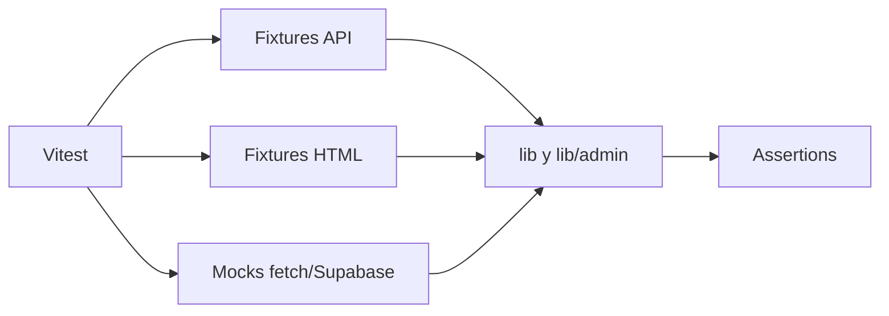

# SDD: Estrategia de testing del dominio y scrapers

> **Estado:** `completado`
> **Autor:** FutFemColombia
> **Fecha:** 2026-09-07
> **Última actualización:** 2026-09-07

---

## 1. Contexto

El mayor riesgo del proyecto está en transformar datos externos y guardarlos sin perder resultados válidos. La suite debe detectar cambios en nombres, fechas, HTML, contratos de validación, reglas de auto-aplicación y persistencia sin depender de la red ni de una base Supabase real.

### Restricciones

- El runner es Vitest v4 en entorno Node.
- La suite actual no prueba UI ni accede a red o Supabase.
- Los externos se sustituyen con fixtures, `fetch` stubbeado y mocks de módulos/cliente.

---

## 2. Objetivos y No-Objetivos

### Objetivos

- Cubrir transformaciones puras y contratos de persistencia.
- Proteger el fallback API/HTML y las reglas de seguridad de scrapers.
- Detectar regresiones de zona horaria y estados de partidos.
- Mantener tests rápidos, deterministas y ejecutables localmente/CI.

### No-Objetivos

- Probar la disponibilidad real de Win Sports o Dimayor.
- Reemplazar pruebas de aceptación del navegador.
- Verificar la implementación interna de cada componente visual.
- Usar cobertura como único criterio de calidad.

---

## 3. Decisiones de Diseño

### Decisión 1: Unit tests con dependencias externas simuladas

- **Elegida:** stub de `fetch`, Supabase y módulos externos.
- **Razón:** los tests deben poder repetirse y no consumir servicios reales.
- **Trade-off:** los fixtures pueden quedar desactualizados frente al proveedor.
- **Reevaluar si:** se incorpora una suite de contrato programada contra sandbox o snapshots reales.

### Decisión 2: Probar comportamiento

- **Elegida:** aserciones sobre datos normalizados, errores, llamadas y estados.
- **Razón:** permite refactorizar sin romper tests sin necesidad.
- **Trade-off:** algunos fallos de implementación solo se detectan por integración.
- **Reevaluar si:** aumentan las rutas que requieren pruebas de integración.

---

## 4. Arquitectura y Flujos

La mayoría de los tests están en `lib/__tests__`, `lib/admin/__tests__` y `lib/validations/__tests__`. `vitest.config.ts` usa alias `@`, entorno `node` y excluye `node_modules`, `.next` y `.opencode`.

---

## 5. Contratos de Interfaz

### Comandos

| Comando | Uso |
|---|---|
| `pnpm test` | Suite una vez |
| `pnpm test:watch` | Ejecución durante desarrollo |
| `pnpm test:coverage` | Reporte de cobertura |

### Áreas cubiertas

| Área | Contratos principales |
|---|---|
| Win Sports API | nombres, fechas, jornadas, semanas, errores HTTP |
| Win Sports HTML | tablas, resultados, próximos y partidos mixtos |
| Persistencia | merge, upsert, estado y preservación de datos |
| Validaciones | equipos, temporadas, partidos y errores Zod |
| Admin scrapers | identificadores, fallback, diff y routing |
| Auto-aplicación | rechazo de vacío/error y aplicación segura |
| Dimayor | nonce, fases, goleadoras y fotos |
| Presentación | fechas/horas y descripciones SEO |
| Rate limit | límite y reinicio de ventana |

---

## 6. Modelo de Datos

Los mocks representan las estructuras mínimas que usan `teams`, `seasons`, `matches`, `standings`, `stage_standings`, `scorers` y `scraper_runs`. Cada test no necesita duplicar el esquema completo de Supabase.

Cuando una prueba depende de una restricción de base de datos, debe indicar si verifica el comportamiento del guardador o una constraint que requiere integración.

---

## 7. Comportamiento y Edge Cases

| Escenario | Expectativa |
|---|---|
| Nombre largo de equipo | Se mapea al nombre local |
| Fecha ISO UTC | Se presenta en `America/Bogota` |
| HTML con diferencia no numérica | Se calcula o normaliza sin romper el parser |
| Partido sin marcador | Se incluye como `scheduled` |
| Marcador nulo entrante | Se conserva el valor local existente |
| Partido con equipos iguales | Falla la validación |
| API externa con 403/429/5xx | Se reintenta según el cliente y se expone el fallo si persiste |
| Scraper vacío o con error | No se auto-aplica |
| Ventana de rate limit expirada | Se permiten nuevas solicitudes |

---

## 8. Estrategia de Testing

### Pruebas unitarias

- Funciones de parsing, mapeo, normalización, formato y validación.
- Guardadores con cliente Supabase en memoria.
- Helpers de respuestas de API y rate limit.

### Integración futura

- Migraciones contra una base Supabase de prueba.
- RLS para lectura pública y acceso autenticado.

### No cubierto por ahora

- Renderizado y accesibilidad de componentes React.
- Navegación completa del panel.
- Disponibilidad real de terceros.

---

## 9. Checklist de Implementación

- [x] Suite Vitest configurada.
- [x] 11 archivos y 71 tests documentados.
- [x] Mocks de red y Supabase.
- [x] Parsers API/HTML cubiertos.
- [x] Persistencia, validaciones y admin cubiertos.
- [x] Formato de fechas, SEO y rate limit cubiertos.
- [ ] Cobertura de rutas API.
- [ ] Pruebas de RLS.
- [ ] Pruebas de UI/E2E.

---

## 10. Changelog de Specs

| Fecha | Cambio | Razón |
|---|---|---|
| 2026-09-07 | Versión inicial |  |
