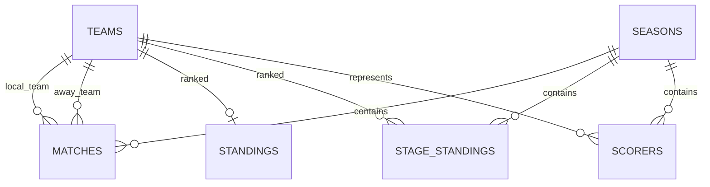

# SDD: Modelo de datos y publicación de información

> **Estado:** `completado`
> **Autor:** FutFemColombia
> **Fecha:** 2026-09-07
> **Última actualización:** 2026-09-07

---

## 1. Contexto

FutFemColombia publica información de la Liga Femenina a partir de una base compartida por los scrapers, el panel administrativo y las páginas públicas. El modelo separa equipos, temporadas, partidos, posiciones, fases finales y goleadoras, evita duplicados y permite consultar los datos públicamente sin exponer operaciones internas.

### Restricciones

- Supabase/Postgres es la fuente persistida de datos de la aplicación.
- Una sola temporada se considera activa para la operación normal.
- Las páginas públicas leen datos; la escritura se realiza desde el panel, scripts o servidor.
- RLS está habilitado en todas las tablas.

---

## 2. Objetivos y No-Objetivos

### Objetivos

- Modelar los datos deportivos con relaciones y claves únicas claras.
- Permitir upserts idempotentes desde los scrapers.
- Publicar lectura de datos deportivos sin exponer previews ni auditoría.
- Soportar fase regular y fase final por grupos.
- Mantener una separación entre identidad del equipo y nombres externos.

### No-Objetivos

- Modelar todas las competiciones del fútbol colombiano.
- Crear un sistema general de CMS.
- Permitir escritura anónima o desde el cliente público.
- Tratar `scraper_runs` como parte del dominio público.

---

## 3. Decisiones de Diseño

### Decisión 1: Equipos reutilizables entre temporadas

- **Elegida:** `teams` es una entidad global y las relaciones deportivas apuntan a `team_id`.
- **Razón:** un equipo puede participar en varias temporadas, y los scrapers necesitan identificarlo a partir de alias externos.
- **Trade-off:** ante un cambio histórico de nombre, hay que decidir si se actualiza la identidad o solo el nombre mostrado.
- **Reevaluar si:** se necesita conservar plantillas o identidades por temporada.

### Decisión 2: Temporada activa como contexto operativo

- **Elegida:** `seasons.is_active` identifica la temporada que usan los procesos actuales.
- **Razón:** simplifica el trabajo de los scrapers, las páginas y las operaciones administrativas.
- **Trade-off:** el modelo debe impedir que haya más de una temporada activa, pero esta restricción también debe reforzarse de forma explícita en la base de datos o el servicio.
- **Reevaluar si:** se habilita comparar o administrar varias temporadas simultáneamente.

### Decisión 3: Fase final separada para posiciones

- **Elegida:** `stage_standings` separada de `standings` y con `stage`/`group_name`.
- **Razón:** las posiciones de Grupo A/B no deben sobrescribir las de la tabla regular.
- **Trade-off:** las consultas y el panel necesitan elegir la fuente correcta por fase.
- **Reevaluar si:** todas las fases adoptan un modelo común de competición.

---

## 4. Arquitectura y Flujos



El flujo de publicación es el siguiente:

1. Un scraper o administrador escribe mediante el servidor.
2. Supabase valida claves únicas, relaciones y RLS.
3. Las rutas públicas consultan las tablas deportivas.
4. Las páginas de inicio, partidos, posiciones, cuadrangulares, equipos y estadísticas muestran los datos guardados.

---

## 5. Contratos de Interfaz

### Entidades principales

```typescript
interface Team {
  id: string;
  name: string;
  full_name: string;
  slug: string;
  city: string | null;
  shield_url: string | null;
}

interface Match {
  id: string;
  season_id: string;
  jornada: number | null;
  phase: string;
  local_team_id: string;
  away_team_id: string;
  local_score: number | null;
  away_score: number | null;
  match_date: string | null;
  match_time: string | null;
  status: 'scheduled' | 'played';
}
```

### Lecturas públicas documentadas

| Ruta | Datos |
|---|---|
| `/api/teams` | Equipos |
| `/api/matches` | Calendario |
| `/api/results` | Resultados |
| `/api/upcoming` | Próximos partidos |
| `/api/standings` | Posiciones regulares |
| `/api/stats` | Estadísticas |
| `/api/cuadrangulares/standings` | Posiciones por grupo |
| `/api/cuadrangulares/bracket` | Llave/fase final |
| `/api/cuadrangulares/status` | Estado de la fase final |
| `/api/data-status` | Estado general de datos |

Las rutas administrativas quedan fuera de este contrato público.

---

## 6. Modelo de Datos

Tablas: `teams`, `seasons`, `matches`, `standings`, `stage_standings`, `scorers`, `scraper_runs` y `admin_audit_log`.

Relaciones y restricciones principales:

- `matches` referencia una temporada y dos equipos. Su clave única evita duplicados por jornada.
- `standings.team_id` es único.
- `stage_standings` es único por temporada, etapa, grupo y equipo.
- `scorers` es único por temporada y jugador.
- `scraper_runs` y `admin_audit_log` son internos.

### RLS

- Lectura pública: equipos, temporadas, partidos, posiciones regulares, posiciones de fase final y goleadoras.
- Lectura autenticada: ejecuciones de scraper y auditoría.
- Escritura: usuarios autenticados según las políticas actuales.

La autorización de la aplicación no debe depender solo de que una tabla pueda leerse públicamente.

---

## 7. Comportamiento y Edge Cases

| Escenario | Comportamiento esperado |
|---|---|
| Slug repetido | Rechazar por unicidad |
| Partido repetido del mismo fixture | Actualizar mediante `upsert` |
| Partido sin marcador | Guardar `scheduled` y scores nulos |
| Equipo eliminado | Respetar FK; no borrar en cascada sin decisión explícita |
| Temporada sin activa | Bloquear procesos que requieren contexto activo |
| Dos grupos de fase final | Consultar `stage_standings` filtrando `group_name` |
| Datos internos solicitados públicamente | Denegar por RLS y no crear endpoint público |

---

## 8. Estrategia de Testing

- Validar schemas Zod del panel para equipos, temporadas y partidos.
- Probar relaciones y claves únicas en migraciones o integración si existe un entorno de base de datos.
- Probar las rutas públicas con fixtures de temporada activa.
- Verificar que `scheduled` no requiera marcador y que `played` tenga el marcador completo.
- Verificar que el cliente público no pueda ver previews ni auditoría.

---

## 9. Riesgos y Mitigaciones

| Riesgo | Probabilidad | Impacto | Mitigación |
|---|---|---|---|
| Más de una temporada activa | Media | Alto | Validación administrativa y restricción futura en DB |
| Datos regulares sobrescritos por fase final | Baja | Alto | Tabla separada y filtros explícitos |
| RLS demasiado permisivo | Media | Alto | Tests de acceso y revisión de políticas |
| Alias que crean equipos duplicados | Media | Alto | Resolver por slug/mapas antes de insertar |

---

## 10. Preguntas Abiertas

- [ ] ¿Se debe agregar una restricción única que garantice una sola temporada activa?
- [ ] ¿Las posiciones regulares deben incluir `season_id` para soportar histórico real?
- [ ] ¿Debe `matches` guardar el ID externo de Win Sports/Opta?
- [ ] ¿Podemos soportar todas las fases de la liga?

---

## 11. Checklist de Implementación

- [x] Esquema consolidado en `supabase/schema.sql`.
- [x] Migraciones históricas conservadas.
- [x] Relaciones y claves de upsert definidas.
- [x] RLS habilitado.
- [x] Rutas públicas y administrativas separadas.
- [x] Validaciones administrativas con Zod.
- [ ] Garantía de una sola temporada activa a nivel de base de datos.
- [ ] Tests de RLS en entorno de integración.

---

## 12. Changelog de Specs

| Fecha | Cambio | Razón |
|---|---|---|
| 2026-09-07 | Versión inicial | Reunir `supabase/schema.md`, `schema.sql` y las rutas de datos existentes. |
