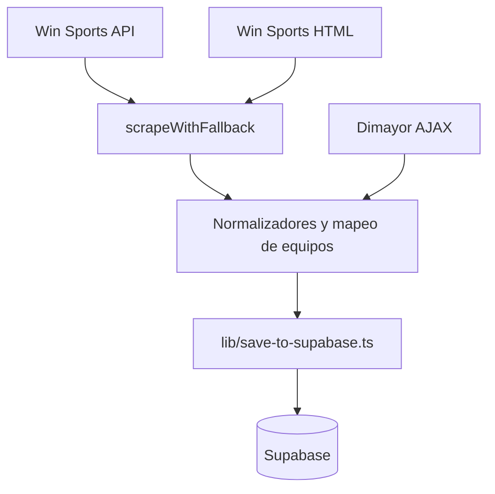

# SDD: Ingesta y normalización de datos deportivos

> **Estado:** `completado`
> **Autor:** FutFemColombia
> **Fecha:** 2026-09-07
> **Última actualización:** 2026-09-07

---

## 1. Contexto

La aplicación debe publicar posiciones, partidos, resultados, próximos encuentros y goleadoras sin que el navegador consulte directamente a las fuentes externas. Cada fuente usa formatos y nombres distintos, puede cambiar sin aviso y, en el caso de Win Sports, algunas etapas todavía no están publicadas en la API.

El pipeline consulta las fuentes, adapta sus respuestas al modelo local y guarda los datos en Supabase. En producción, la aplicación Next.js solo lee Supabase.

### Restricciones

- Win Sports no ofrece una API pública documentada; sus endpoints son internos y pueden cambiar.
- El HTML es un respaldo, no una garantía de disponibilidad.
- Las fechas de Win Sports llegan en UTC y se convierten a `America/Bogota`.
- Dimayor puede bloquear las IP de Vercel; el scraper de goleadoras se ejecuta manualmente/localmente.
- Los scrapers requieren `NEXT_PUBLIC_SUPABASE_URL`, `SUPABASE_SERVICE_ROLE_KEY` y, para goleadoras, `DIMAYOR_COMPETITION_ID`.

---

## 2. Objetivos y No-Objetivos

### Objetivos

- Obtener datos de Win Sports mediante API y usar HTML como fallback.
- Obtener goleadoras desde Dimayor con reintentos y rotación de nonce.
- Mapear nombres externos a equipos locales y normalizar fechas, jornadas, marcadores y estados.
- Producir datos idempotentes que puedan guardarse con `upsert` sin duplicar partidos.
- Conservar datos locales importantes cuando una fuente devuelve valores vacíos.

### No-Objetivos

- Hacer fetch directo a Win Sports o Dimayor desde las páginas públicas.
- Garantizar estabilidad de endpoints privados de terceros.
- Resolver automáticamente cambios semánticos de una fuente externa.
- Ejecutar el scraper de goleadoras en entornos cloud donde Dimayor bloquea la IP.

---

## 3. Decisiones de Diseño

### Decisión 1: API con fallback HTML

- **Opciones consideradas:** solo API vs solo HTML vs API y HTML.
- **Elegida:** usar la API y recurrir al HTML como fallback, con validación de usabilidad.
- **Razón:** la API entrega datos estructurados, pero el HTML puede seguir disponible cuando una etapa todavía no está publicada en la API.
- **Trade-off:** mantener dos parsers y aceptar advertencias cuando se usa una fuente degradada.
- **Reevaluar si:** Win Sports publica una API estable/documentada o deja de exponer el HTML necesario.

### Decisión 2: Normalización antes de persistir

- **Opciones consideradas:** guardar payload externo vs normalizar en consultas vs normalizar antes de guardar.
- **Elegida:** normalizar antes de guardar.
- **Razón:** la aplicación y Supabase trabajan con nombres, estados y fechas consistentes.
- **Trade-off:** el mapeo local debe actualizarse cuando aparecen alias nuevos.
- **Reevaluar si:** se necesita conservar múltiples proveedores o reproducir transformaciones históricas.

### Decisión 3: Clave natural para partidos

- **Elegida:** `season_id + jornada + local_team_id + away_team_id`.
- **Razón:** permite `upsert` idempotente aun cuando la fuente entregue un identificador Opta que no forma parte del modelo local.
- **Trade-off:** un cambio de jornada o de equipos no se interpreta como actualización del mismo registro.
- **Reevaluar si:** se incorpora un identificador externo persistente al modelo.

---

## 4. Arquitectura y Flujos



Para Win Sports:

1. El script solicita la fuente primaria o usa el parser HTML según el scraper.
2. `scrapeWithFallback` valida que la respuesta no esté vacía ni degradada.
3. El sistema normaliza equipos, jornadas, fechas y estados.
4. El sistema obtiene la temporada activa y genera un preview/diff.
5. El resultado se guarda o queda pendiente de revisión según la política del scraper.

---

## 5. Contratos de Interfaz

### Identificadores de scrapers

```typescript
type ScraperName =
  | 'standings'
  | 'matches'
  | 'results'
  | 'upcoming'
  | 'scorers'
  | 'stage-standings'
  | 'cuadrangular-matches';
```

También existen variantes `*-html` para ejecutar explícitamente el parser HTML.

### Comandos

| Comando | Fuente | Resultado |
|---|---|---|
| `pnpm scrape:standings` | Win Sports | `teams`, `standings` |
| `pnpm scrape:stage-standings` | Win Sports | `stage_standings` |
| `pnpm scrape:matches` | Win Sports | `matches` de fase regular |
| `pnpm scrape:results` | Win Sports | resultados en `matches` |
| `pnpm scrape:upcoming` | Win Sports | próximos partidos en `matches` |
| `pnpm scrape:cuadrangular-matches` | Win Sports | partidos de fase final |
| `pnpm scrape:scorers` | Dimayor | `scorers` |
| `pnpm scrape:all` | Ambas | ejecuta los anteriores en secuencia |

### Reglas de normalización

- `played` cuando existen marcadores; `scheduled` cuando no existen.
- `goalDifference` puede llegar como `"+25"` y se convierte a número.
- `isFuture=true` se usa para programados y `false` para resultados.
- `mergeFields` conserva marcador y fecha/hora existentes si el nuevo valor es `null`.

---

## 6. Modelo de Datos

No se crean tablas nuevas. Los datos se guardan en `teams`, `seasons`, `matches`, `standings`, `stage_standings` y `scorers`. Las claves únicas relevantes son:

- `teams.slug`.
- `matches(season_id, jornada, local_team_id, away_team_id)`.
- `standings.team_id`.
- `stage_standings(season_id, stage, group_name, team_id)`.
- `scorers(season_id, player_id)`.

Los scrapers usan `service_role` para persistir; el acceso público a los datos se realiza mediante las políticas de lectura de Supabase.

---

## 7. Comportamiento y Edge Cases

### Happy path

1. El sistema encuentra la temporada activa.
2. La fuente devuelve datos utilizables.
3. El sistema mapea los equipos conocidos y normaliza los registros.
4. Se aplica un `upsert` sin duplicar partidos.

### Edge cases

| Escenario | Comportamiento esperado |
|---|---|
| API vacía o inválida | Intentar HTML y registrar advertencia |
| API y HTML degradados | No auto-aplicar datos riesgosos; conservar preview/error |
| Etapa cuadrangular sin publicar | Tratar `404` como fuente no disponible |
| Equipo con nombre nuevo | Usar el nombre recibido y advertir para añadir alias |
| Fecha sin hora | No auto-aplicar partidos programados |
| Repetición del scraper | `upsert` idempotente |
| Goleadoras bloqueadas por Dimayor | Fallar de forma visible y ejecutar localmente |

### Validaciones

- La tabla de fase final (cuandrangulares) debe tener 4 equipos en Grupo A y 4 en Grupo B.
- Los partidos deben tener equipos local y visitante distintos.
- La temporada activa debe existir antes de guardar los datos.
- Los partidos requieren fecha y hora completas para ser considerados seguros para auto-aplicación.

---

## 8. Estrategia de Testing

- Probar parsers API y HTML con payloads estáticos.
- Probar conversión horaria, nombres, jornadas, marcadores y semanas futuras.
- Probar `upsert`, `mergeFields`, deduplicación y estados `played`/`scheduled`.
- Probar errores HTTP, respuestas vacías y fallbacks.
- No probar la disponibilidad real de terceros en la suite unitaria.

---

## 9. Riesgos y Mitigaciones

| Riesgo | Probabilidad | Impacto | Mitigación |
|---|---|---|---|
| Cambia el JSON o HTML de Win Sports | Alta | Alto | Tests con fixtures, fallback y warnings |
| Alias de equipo no reconocido | Media | Alto | Mapas centralizados y revisión del preview |
| Datos parciales sobrescriben datos válidos | Media | Alto | `mergeFields` y reglas de auto-aplicación |
| Rate limit o bloqueo externo | Media | Medio | 200 ms entre semanas, reintentos y ejecución manual |

---

## 10. Checklist de Implementación

- [x] Clientes API y HTML implementados.
- [x] Mapeo de equipos y fechas implementado.
- [x] Persistencia idempotente implementada.
- [x] Fallback y advertencias implementados.
- [x] Tests unitarios de parsers y persistencia.
- [x] Scripts documentados en `docs/SCRAPERS.md`.
- [ ] Contrato versionado para cambios de fuentes externas.

---

## 11. Changelog de Specs

| Fecha | Cambio | Razón |
|---|---|---|
| 2026-09-07 | Versión inicial | Consolidar la documentación de `docs/Scraping Win Sports.md` y `docs/Winsports-api.md`. |
